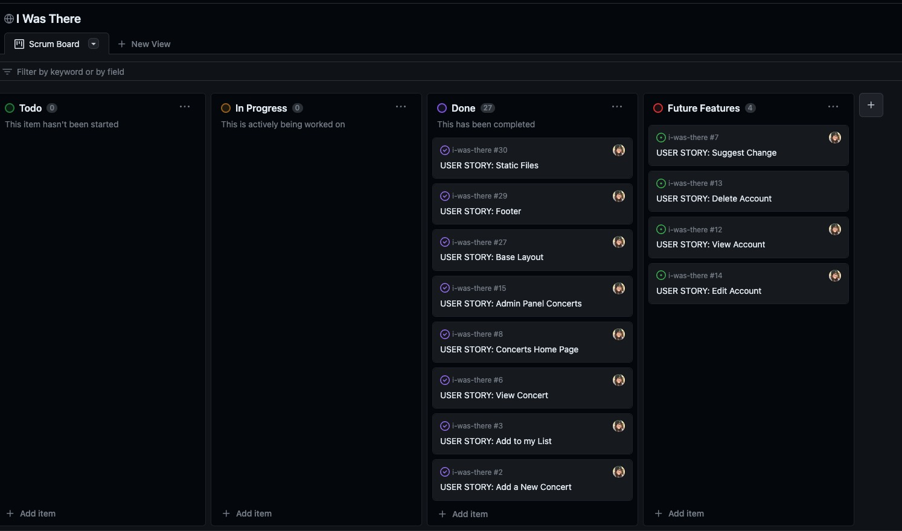
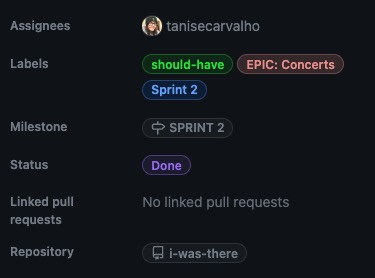

# I Was There - AGILE DEVELOPMENT PROCESS

This project used GitHub Projects Tool to create the Scrum board and use agile methodology. [Link for board](https://github.com/users/tanisecarvalho/projects/3/views/1).

## Epics

This project has 4 epics:

* Base Setup
* Concerts
* Account
* Admin

## Sprints

This project had 5 sprints. The first one dedicated to Base Setup and the last one to testing and documentation.

## Labels & Milestones

This project used labels for Epics, Sprints, priority (MoSCoW) and Milestones for Sprints to organise its development.

