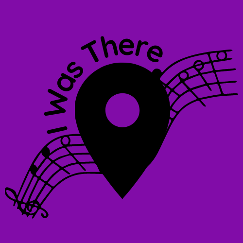
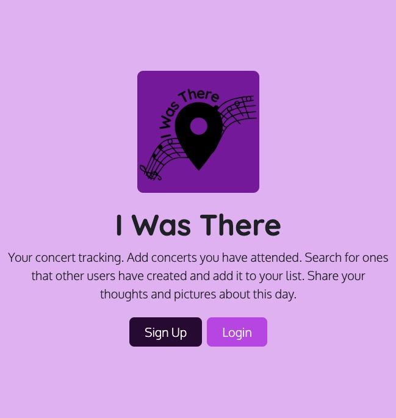

# I Was There

### Deployed Site: [I Was There](https://i-was-there-d5ba14a8429f.herokuapp.com/)

I Was There is a concert tracking for those concerts' aficionados who would like to keep track of the gigs they went to.

With I Was the user will be able to create an account, add, edit and delete concerts they have attended. 

They can also add concerts to their list which was created by another user and post their favorite picture and comment about it.

The users will be able to see the list of concerts they have attended, created, and also concerts posted by other users.

---

## CONTENTS

* [User Experience](#user-experience-ux)
  * [Project Goals](#project-goals)
  * [User Stories](#user-stories)

* [Design](#design)
  * [Colour Scheme](#colour-scheme)
  * [Typography](#typography)
  * [Imagery](#imagery)
  * [Wireframes](#wireframes)
  * [Flow Chart](#flow-chart)
  * [Database Schema](#database-schema) 

* [Agile Development Process](#agile-development-process)

* [Features](#features)

* [Technologies Used](#technologies-used)
  * [Languages Used](#languages-used)
  * [Frameworks, Libraries & Programs Used](#frameworks-libraries--programs-used)

* [Testing](#testing)

* [Deployment & Local Development](#deployment--local-development)
  * [Remote Deployment](#remote-deployment)
  * [Local Development](#local-deployment)
    * [How to Fork](#how-to-fork)
    * [How to Clone](#how-to-clone)
    * [Using Gitpod](#using-gitpod)

* [Credits](#credits)
  * [Code Used](#code-used)
  * [Acknowledgments](#acknowledgments)

---

## User Experience (UX)

### Project Goals

The goal of this project is to provide users who love going concerts to keep track of the concerts they have attended and share their experiences and pictures.

### User Stories

- As a first time visitor I can see the website home page so that I can understand what this website is about
- As a Site User I can create a concert so that I can add it to my list and share it with other users
- As a Site User I can add a concert created by other user so that I have it on my list
- As a Site User I can edit a concert that I created so that I can change misinformation.
- As a Site User I can delete a concert so that I can remove it from my list
- As a site user I can view a concert so that I can check all the comments and gallery
- As a Site User I can see all concerts created on the site so that I can add the ones I went to my list
- As a Site User I can create an account so that I can have access to the concerts and add my owns
- As a Site User I can login to my account so that I can have full access to my information
- As a Site User I can log out of my account so that I can keep my account disconnected while not using it.
- As a Site Admin I can add a concert so that users can see it
- As a Site Admin I can see users suggestions so I can edit concerts in case the suggestion is valid
- As a Site Admin I can delete concerts so that I can eliminate duplication and wrong information
- As a Site Admin I can delete users so that I can mantain a safe environment for the users

### Future Developement

- As a Site User I can view my profile so that I have access to an overview of concerts I have attended
- As a Site User I can delete my account so that I can stop using the website
- As a Site User I can update my profile so that I can upload new information to it.
- As a Site User I can suggest a change on a concert to the admin so that the concert will have the correct information.

___

## Design

### Colour Scheme

The palette was defined using [Color Hunt](https://colorhunt.co/palette/2d033b810ca8c147e9e5b8f4). I knew I wanted to use purple and black as the two main colours.

When I searched on the website for palettes with both colours, this one got my attention straightway.

- #2D033B
- #810CA8
- #C147E9
- #E5B8F4

### Typography

Google Fonts was used to select and import the fonts on this project.

For the logo and headings, the font is Quicksand.

For the body and forms, the font is Oxygen.

### Imagery

The logo was created using [Canva](https://www.canva.com/). The idea came from mixing a pin location map and musical notes.

- Logo

### Wireframes

All the wireframes were created using [Balsamiq](https://balsamiq.com/).

  
Index

   

  

  
Signup

   

  

  
Login

   

  

  
Logout

   

  

  
Home

   

  

  
Profile

   

  

  
Concerts

   

  * My Concerts
  

   

  * Add Concert
  

   

  * Add To My List
  

   

  * Edit Concert
  

   

  * Delete Concert
  

   

  * View Concert
  

### Flow Chart

The flow chart was created using [Draw.io](https://draw.io/).

  
Flow Chart

   

  

### Database Schema
- The user model was created with Django-Allauth.

---

## Agile Development Process

Please check the [AGILE.md](AGILE.md) file to see all the Agile Development Process.

---

## Features

- Favicon: logo on all the pages

  

- Navbar

  

- Navbar - logged user

  

- Footer

  

- Messages

  

- Home Page

  

- Register

  

- Login

  

- Logout

  

- Home - Concerts

  

- My Concerts

  

- Pagination on My Concerts and Concerts pages

  

- Add Concert

  

- Edit Concert

  

- Add To My List

  

- Delete Concert

  

- View Concert

  

- View Concert - Gallery

  

- View Concert - Buttons

  

---

## Technologies Used

### Languages Used

  - HTML5
  - CSS3
  - JavaScript
  - Python

### Frameworks, Libraries & Programs Used

This project used:

* [Balsamiq](https://balsamiq.com/) to create the wireframes.

* [Git](https://git-scm.com/) for version control.

* [GitHub](https://github.com/) to store the project files.

* [VS Code](https://code.visualstudio.com/) as the IDE for development.

* [Django](https://www.djangoproject.com/) as the Python Framework.

* [Draw.io](https://draw.io/) to create the flow chart.

* [Heroku](https://www.heroku.com/home/) to deploy the website.

* [ElephantSQL](https://www.elephantsql.com/) to host the database.

* [Cloudinary](https://cloudinary.com/) to host images.

* [Django-allauth](https://django-allauth.readthedocs.io/en/latest/) to create accounts.

* [Django Crispy Forms](https://django-crispy-forms.readthedocs.io/en/latest/) to create the forms based on the models.

* [Gunicorn](https://gunicorn.org/) as the webserver to host Django on Heroku.

* [dj-database-url](https://pypi.org/project/dj-database-url/) to create DATABASE_URL to configure the Django application.

* [psycopg2](https://pypi.org/project/psycopg2/) as PostgreSQL adapter.

* [Whitenoise](https://whitenoise.readthedocs.io/en/latest/index.html) to host static files.

* [Tables Generator](https://www.tablesgenerator.com/markdown_tables) to create tables for TESTING.md

* [RandomKeyGen](https://randomkeygen.com/) to create the SECRET_KEY for the project.

* [Favicon](https://favicon.io/) to transform the logo into a favicon.

* [Canva](https://www.canva.com/) to create the logo.

* [Google Fonts](https://fonts.google.com/) to import the fonts used on the website.

* [Bootstrap](https://getbootstrap.com/) for layout.

* [Color Hunt](https://colorhunt.co/) to select the colour scheme.

---

## Testing

Please check the [TESTING.md](TESTING.md) file for all the tests.

---

## Deployment & Local Development

### Remote Deployment

Before deploying, run 'pip3 freeze > requirements.txt' on the terminal of your IDE of choice.

The site was deployed to Heroku. The steps to deploy are as follows: 
  1. Create an account and log in your [Heroku](https://id.heroku.com/login) account. 
  2. On the dashboard, click on the button New -> Create new app on the right side of the page.
  3. Choose a name and select your region. Click on Create app.
  4. Go to the Settings tab. Scroll down to Config Vars. 
  - Add key PORT and value 8000.
  - Add key DATABASE_URL and add the value of your database on ElephantSQL or other host of choice.
  - Add key CLOUDINARY_URL and add the value of your cloudinary host link.
  - Add key SECRET_KEY and add the value of your choice for this secret key.
  - Add key DISABLE_COLLECTSTATIC and add the value of 1. (Don't forget to remove this key before the final deployment.)
  5. Go to the Deploy tab. Select GitHub as Deployment Method. Connect your account.
  6. Enter the name of the repository that you forked, search and connect.
  7. Select the branch and click Deploy Branch.

The live link can be found here - [I Was There](https://i-was-there-d5ba14a8429f.herokuapp.com/)

### Local Development

#### How to Fork

  1. Log In or Sign Up to GitHub.
  2. Go to this project repository [https://github.com/tanisecarvalho/i-was-there](https://github.com/tanisecarvalho/i-was-there)
  2. On the top right of the page, there's a button with the option Fork. Click on it.
  3. A new page, "Create a new fork", will open. If you wish, you can edit the name.
  4. At the end of the page, click on "Create fork".
  5. Now, you have a copy of the project in your repositories.

#### How to Clone

  1. Log In or Sign Up to GitHub.
  2. Go to this project repository [https://github.com/tanisecarvalho/i-was-there](https://github.com/tanisecarvalho/i-was-there)
  3. Click on the Code button and select if you would like to clone with HTTPS, SSH or GitHub CLI and copy the link.
  4. Open the terminal in the code editor of your choice and change the current working directory to the one you will use for to clone the repository.
  5. Type 'git clone' into the terminal and then paste the link you copied before and press Enter.

#### Using Gitpod
If you would like to edit your copy of this repository on Gitpod, you will need to: 
  1. On your browser of choice, install the Gitpod extension/add-on.
  2. On GitHub, open the project repository you forked before.
  3. On the top of the page, over the files, there is a green button on the right side of the page saying "Gitpod". Click it.
  4. It will open the Gitpod website. On the first time, you will select to connect with your GitHub account and Authorize gitpod-io. After that, you'll create an account.
  5. It might take a while after that because Gitpod will create your workspace.
  After the workspace is loaded, you can edit it on Gitpod.

---

## Credits

### Code Used

- Used [FreeCodeCamp](https://www.freecodecamp.org/news/how-to-setup-virtual-environments-in-python/) article to learn how to set up a virtual environment in Python.
- Used [this](https://www.youtube.com/watch?v=KHF6nysy0-c&t=205s) YouTube tutorial to add consistent height to the gallery carousel and CSS grandients to its text. 
- Used [GeeksForGeeks](https://www.geeksforgeeks.org/built-in-error-views-in-django/) to understand how to raise built-in errors in Django views.
- Used [Cloudinary](https://cloudinary.com/documentation/django_image_and_video_upload) documentation to help on uploading images through form.
- Used [this Django tutorial](https://www.youtube.com/playlist?list=PLXuTq6OsqZjbCSfiLNb2f1FOs8viArjWy) on youtube to guide help me on my doubts.

### Acknowledgments

I would like to thank my mentor David Bowers who became my mentor just a few days before this project started and has supported it from the start. 

To my partner, friends and family who have supported me during all this journey.

To the women on my co-hort and our facilitator Laura who have been supportive of this new phase of my career and keep cheering and giving words of support on the meetings I can show up.

[Back to Top](<#i-was-there>)