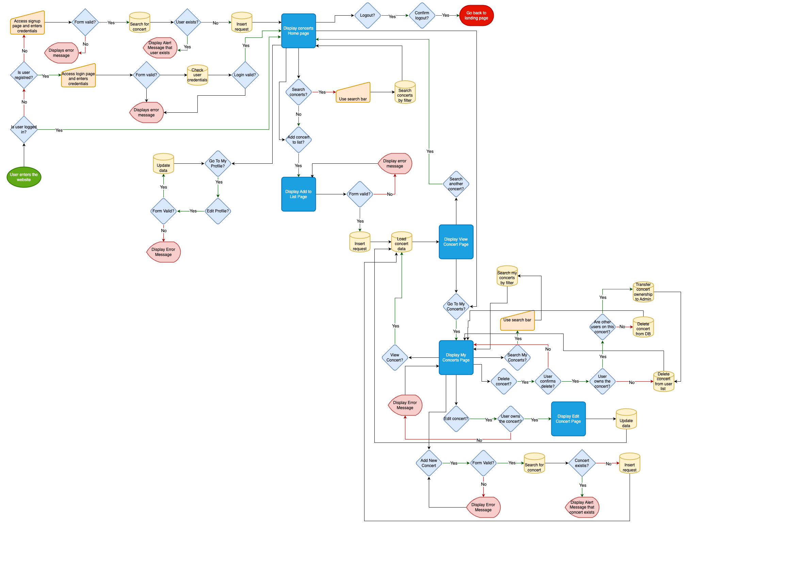

# I Was There

### Deployed Site: [I Was There](https://i-was-there-d5ba14a8429f.herokuapp.com/)

I Was There is a concert tracking for those concerts' aficionados who would like to keep track of the gigs they went to.

With I Was the user will be able to create an account, add, edit and delete concerts they have attended. 

They can also add concerts to their list which was created by another user and post their favorite picture and comment about it.

The users will be able to see the list of concerts they have attended, created, and also concerts posted by other users.

---

## CONTENTS

* [User Experience](#user-experience-ux)
  * [Project Goals](#project-goals)
  * [User Stories](#user-stories)

* [Design](#design)
  * [Colour Scheme](#colour-scheme)
  * [Typography](#typography)
  * [Imagery](#imagery)
  * [Wireframes](#wireframes)
  * [Flow Chart](#flow-chart)
  * [Database Schema](#database-schema) 

* [Agile Development Process](#agile-development-process)

* [Features](#features)

* [Technologies Used](#technologies-used)
  * [Languages Used](#languages-used)
  * [Python Modules](#python-modules)
  * [Frameworks, Libraries & Programs Used](#frameworks-libraries--programs-used)

* [Testing](#testing)

* [Deployment & Local Development](#deployment--local-development)
  * [Remote Deployment](#remote-deployment)
  * [Local Development](#local-deployment)
    * [How to Fork](#how-to-fork)
    * [How to Clone](#how-to-clone)
    * [Using Gitpod](#using-gitpod)

* [Credits](#credits)
  * [Code Used](#code-used)
  * [Acknowledgments](#acknowledgments)

---

## User Experience (UX)

### User Stories

___

## Design

### Colour Scheme

The palette was defined using [Color Hunt](https://colorhunt.co/palette/2d033b810ca8c147e9e5b8f4). I knew I wanted to use purple and black as the two main colours.

When I searched on the website for palettes with both colours, this one got my attention straightway.

- #2D033B
- #810CA8
- #C147E9
- #E5B8F4

### Typography

Google Fonts was used to select and import the fonts on this project.

For the logo and headings, the font is Quicksand.

For the body and forms, the font is Oxygen.

### Imagery

The logo was created using [Canva](https://www.canva.com/). The idea came from mixing a pin location map and musical notes.

- Logo

### Wireframes

All the wireframes were created using [Balsamiq](https://balsamiq.com/).

  
Index

   

  

  
Signup

   

  

  
Login

   

  

  
Logout

   

  

  
Home

   

  

  
Profile

   

  

  
Concerts

   

  * My Concerts
  

   

  * Add Concert
  

   

  * Add To My List
  

   

  * Edit Concert
  

   

  * Delete Concert
  

   

  * View Concert
  

### Flow Chart

The flow chart was created using [Draw.io](https://draw.io/).

  
Flow Chart

   

  

### Database Schema

---

## Agile Development Process

Please check the [AGILE.md](AGILE.md) file to see all the Agile Development Process.

---

## Features

---

## Technologies Used

### Languages Used

### Python Modules

### Frameworks, Libraries & Programs Used

---

## Testing

Please check the [TESTING.md](TESTING.md) file for all the tests.

---

## Deployment & Local Development

### Remote Deployment

### Local Development

#### How to Fork

  1. Log In or Sign Up to GitHub.
  2. Go to this project repository [https://github.com/tanisecarvalho/i-was-there](https://github.com/tanisecarvalho/i-was-there)
  2. On the top right of the page, there's a button with the option Fork. Click on it.
  3. A new page, "Create a new fork", will open. If you wish, you can edit the name.
  4. At the end of the page, click on "Create fork".
  5. Now, you have a copy of the project in your repositories.

#### How to Clone

  1. Log In or Sign Up to GitHub.
  2. Go to this project repository [https://github.com/tanisecarvalho/i-was-there](https://github.com/tanisecarvalho/i-was-there)
  3. Click on the Code button and select if you would like to clone with HTTPS, SSH or GitHub CLI and copy the link.
  4. Open the terminal in the code editor of your choice and change the current working directory to the one you will use for to clone the repository.
  5. Type 'git clone' into the terminal and then paste the link you copied before and press Enter.

#### Using Gitpod
If you would like to edit your copy of this repository on Gitpod, you will need to: 
  1. On your browser of choice, install the Gitpod extension/add-on.
  2. On GitHub, open the project repository you forked before.
  3. On the top of the page, over the files, there is a green button on the right side of the page saying "Gitpod". Click it.
  4. It will open the Gitpod website. On the first time, you will select to connect with your GitHub account and Authorize gitpod-io. After that, you'll create an account.
  5. It might take a while after that because Gitpod will create your workspace.
  After the workspace is loaded, you can edit it on Gitpod.

---

## Credits

### Code Used

- Used [RandomKeyGen](https://randomkeygen.com/) to create the SECRET_KEY for the project.
- Used [FreeCodeCamp](https://www.freecodecamp.org/news/how-to-setup-virtual-environments-in-python/) article to learn how to set up a virtual environment in Python.
 
### Acknowledgments

[Back to Top](<#i-was-there>)