# I Was There - TESTING

## VALIDATION

### CSS

The CSS on style.css was validated on [Jigsaw Validator](https://jigsaw.w3.org/css-validator/) on the input mode.

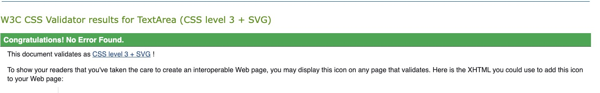

### CI Python Linter

- I Was There settings.py
    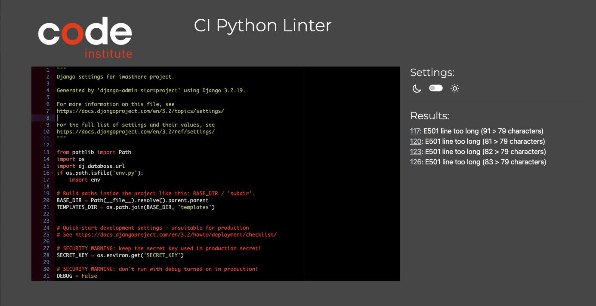
- I Was There urls.py
    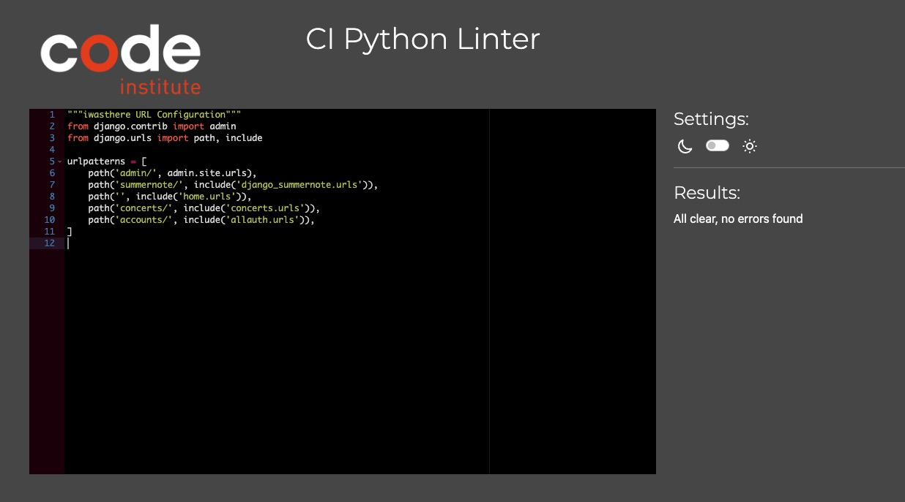
- Home app urls.py
    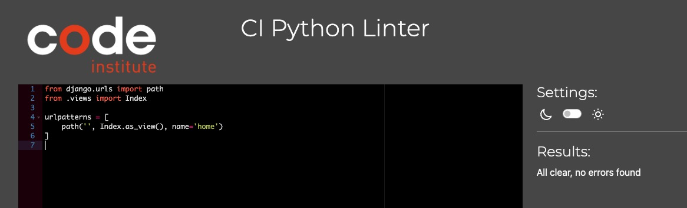
- Home app views.py
    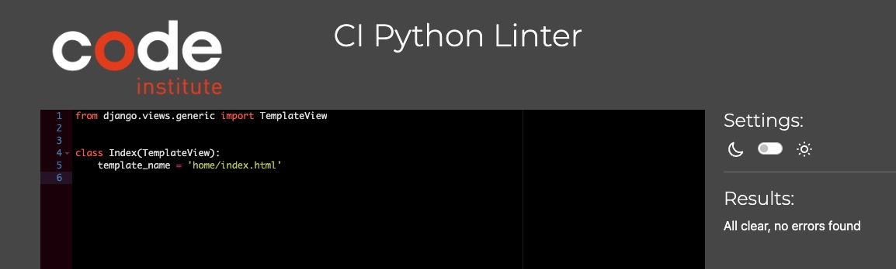
- Concerts app views.py
    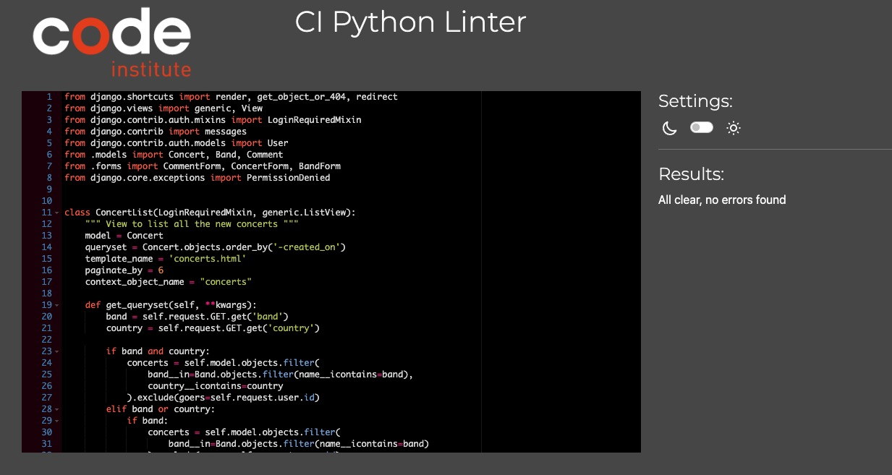
- Concerts app urls.py
    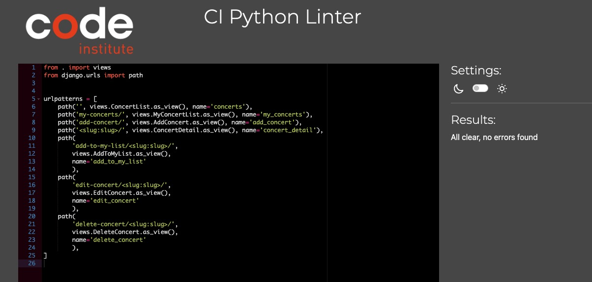
- Concerts app models.py
    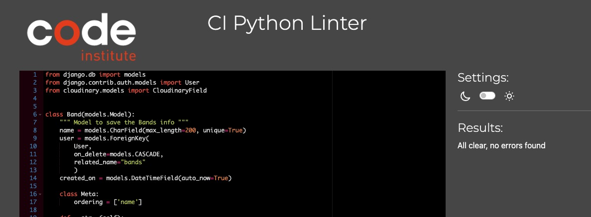
- Concerts app forms.py
    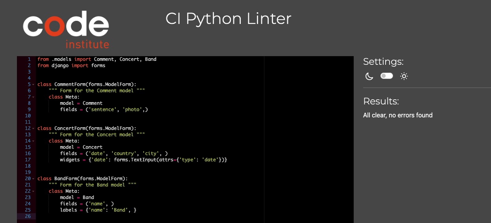
- Concerts app admin.py
    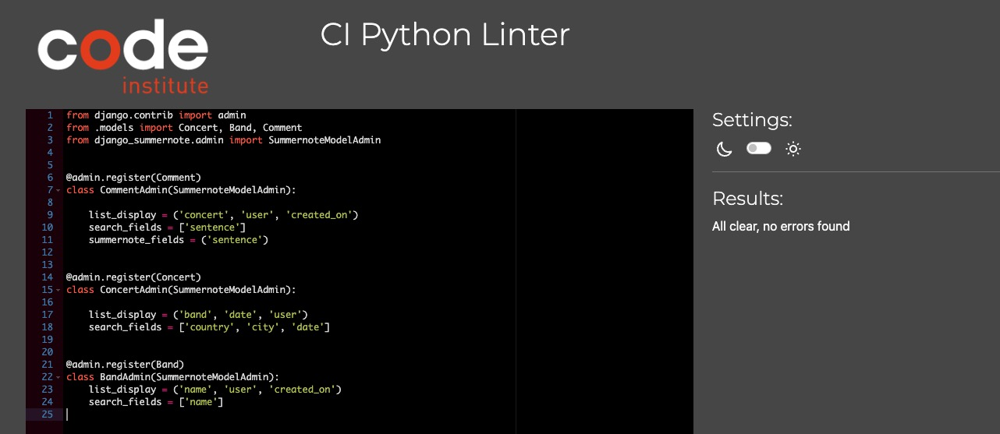

### Lighthouse

I used Chrome Developer Tools' Lighthouse to test the Performance, Accessibility, Best practices and SEO of this project.

- Desktop

    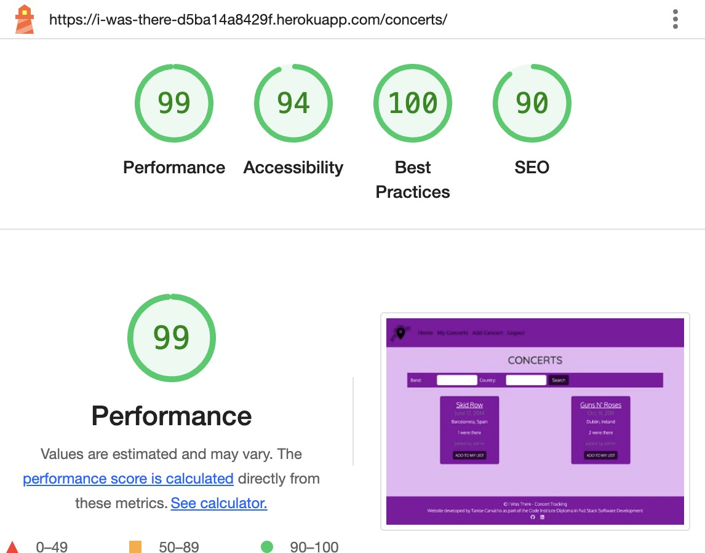

- Mobile 

    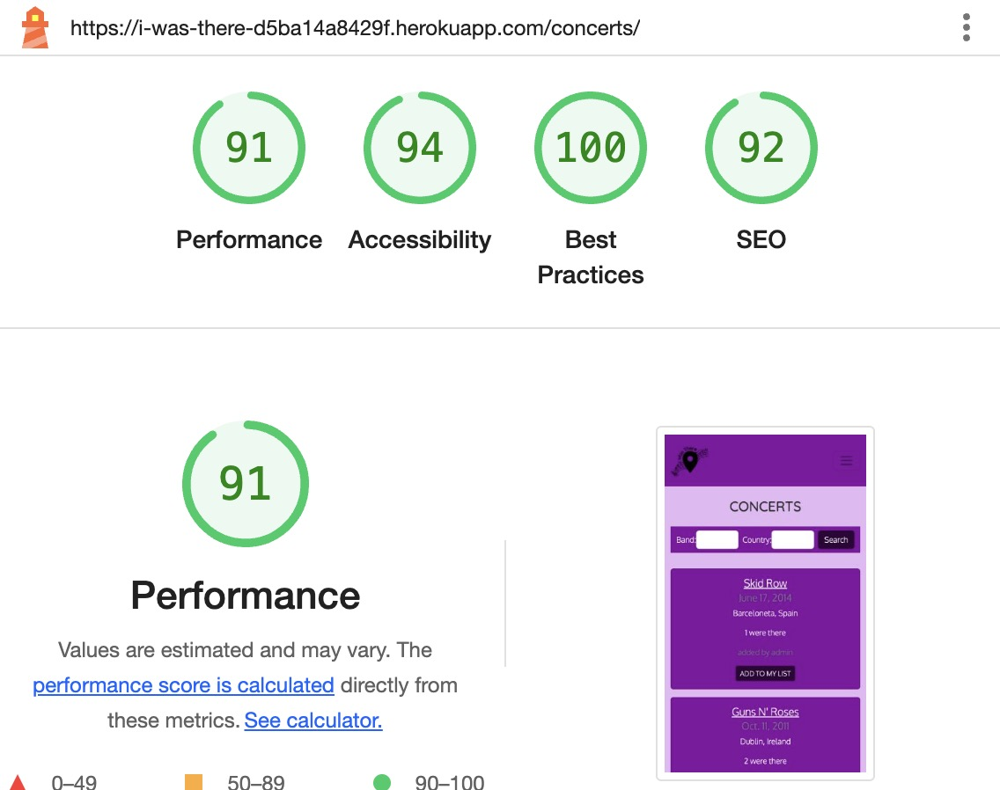

## MANUAL TESTING

This site was tested in the following devices:

* Laptop
  * 13-inch MacBook Air 2020 (+ LG 22-inch Monitor)
    * Browsers: Google Chrome, Firefox and Safari.
* Mobile
  * iPhone SE 2020
    * Browsers: Google Chrome and Safari
  * Xiaomi 11 Lite 5G NE
    * Browser: Google Chrome

`Nav Bar`

| Feature     | Expected Outcome                                        | Test Performed                              | Result                           | Test Outcome |
|-------------|---------------------------------------------------------|---------------------------------------------|----------------------------------|--------------|
| Logo        | Goes to home page                                       | Click on the logo on the top left.          | Goes to the home page.           | PASS         |
| Home        | Goes to home page when user is not logged in            | Click on the Home menu item.                | Goes to the home page.           | PASS         |
| Home        | Goes to the Concerts page when user is logged in        | Click on the Home menu item when logged in. | Goes to the Concert page.        | PASS         |
| Register    | Goes to the signup page.                                | Click on the Register menu item.            | Goes to the signup page.         | PASS         |
| Login       | Goes to the Login page.                                 | Click on the Login menu item.               | Goes to the login page.          | PASS         |
| My Concerts | Goes to the My Concerts Page when user is logged in.    | Click on the My Concerts menu item.         | Goes to the My Concerts page.    | PASS         |
| Add Concert | Goes to the New Concert Page when user is logged in.    | Click on the Add Concert menu item.         | Goes to the New Concert page.    | PASS         |
| Logout      | Goes to the Confirm Logout page when user is logged in. | Click on the Logout menu item.              | Goes to the Confirm Logout page. | PASS         |

`Footer`

| Feature                 | Expected Outcome                       | Test Performed              | Result                                            | Test Outcome |
|-------------------------|----------------------------------------|-----------------------------|---------------------------------------------------|--------------|
| Developer GitHub Link   | Goes to the developer's GitHub page.   | Click on the GitHub icon.   | Opens a new tab with the developer GitHub page.   | PASS         |
| Developer LinkedIn Link | Goes to the developer's LinkedIn page. | Click on the LinkedIn icon. | Opens a new tab with the developer LinkedIn page. | PASS         |

`Home Page`

| Feature        | Expected Outcome         | Test Performed             | Result                   | Test Outcome |
|----------------|--------------------------|----------------------------|--------------------------|--------------|
| Sign Up button | Goes to the signup page. | Click on the Signup button | Goes to the signup page. | PASS         |
| Login Button   | Goes to the Login page.  | Click on the Login button. | Goes to the login page.  | PASS         |

`Register`

| Feature                          | Expected Outcome                                         | Test Performed               | Result                                                   | Test Outcome |
|----------------------------------|----------------------------------------------------------|------------------------------|----------------------------------------------------------|--------------|
| Sign In link                     | Goes to the login page.                                  | Click on the sign in link.   | Goes to the login page.                                  | PASS         |
| Sign Up Button                   | Submits new user information and create a new account.   | Click on the sign up button. | Submits new user information and create a new account.   | PASS         |
| Sign Up Button - Redirection     | After create new account redirects to the Concerts page. | Click on the sign up button. | After account is created redirects to the Concerts page. | PASS         |
| Sign Up Button - Form Validation | Prevent create new account without form filled up.       | Click on the sign up button. | Prevents create new account without form filled up.      | PASS         |
| Sign Up Button - Message         | Shows a message informing that the user is signed in.    | Click on the sign up button. | Shows a message informing that the user is signed in.    | PASS         |

`Login`

| Feature                          | Expected Outcome                                        | Test Performed               | Result                                                   | Test Outcome |
|----------------------------------|---------------------------------------------------------|------------------------------|----------------------------------------------------------|--------------|
| Sign up link                     | Goes to the sign up page.                               | Click on the sign up link.   | Goes to the sign up page.                                | PASS         |
| Sign In Button                   | Submits user login information to access their account. | Click on the sign in button. | Submits user login information to access their account.  | PASS         |
| Sign In Button - Redirection     | After login redirects to the Concerts page.             | Click on the sign in button. | After account is created redirects to the Concerts page. | PASS         |
| Sign In Button - Form Validation | Prevent login without form filled up.                   | Click on the sign in button. | Prevent login without form filled up.                    | PASS         |
| Sign In Button - Message         | Shows a message informing that the user is logged in.   | Click on the sign in button. | Shows a message informing that the user is logged in.    | PASS         |

`Home/Concerts Page`

| Feature                      | Expected Outcome                                                         | Test Performed                                                       | Result                                                                   | Test Outcome |
|------------------------------|--------------------------------------------------------------------------|----------------------------------------------------------------------|--------------------------------------------------------------------------|--------------|
| Concerts List                | Shows all the concerts the user hasn't added to their list.              | Opened concerts page.                                                | Shows all the concerts the user hasn't added to their list.              | PASS         |
| Search - By Band             | Shows all the concerts by the band entered on the band field.            | Entered the band name and clicked on the search button.              | Shows all the concerts by the band entered on the band field.            | PASS         |
| Search - By Country          | Shows all the concerts on the country entered on the country field.      | Entered the country name and clicked on the search button.           | Shows all the concerts on the country entered on the country field.      | PASS         |
| Search - By Band and Country | Shows all the concerts by the band on the country entered on the fields. | Entered the band and country names and clicked on the search button. | Shows all the concerts by the band on the country entered on the fields. | PASS         |
| Band's Name                  | Goes to View Concert Page.                                               | Clicked on the band's name.                                          | Goes to View Concert Page.                                               | PASS         |
| Add To My List Button        | Goes to Add To My List Page.                                             | Clicked on the button Add to My List.                                | Goes to Add To My List Page.                                             | PASS         |
| Pagination                   | When there are more than 6 concerts shows pagination.                    | Added more than 6 concerts.                                          | Showed pagination when there are more than 6 concerts.                   | PASS         |

`My Concerts`

| Feature                      | Expected Outcome                                                                            | Test Performed                                                       | Result                                                                                      | Test Outcome |
|------------------------------|---------------------------------------------------------------------------------------------|----------------------------------------------------------------------|---------------------------------------------------------------------------------------------|--------------|
| Concerts List                | Shows all the concerts the user has added to their list and created.                        | Opened My Concerts page.                                             | Shows all the concerts the user has added to their list and created.                        | PASS         |
| Search - By Band             | Shows all the concerts the user has added by the band entered on the band field.            | Entered the band name and clicked on the search button.              | Shows all the concerts the user has added by the band entered on the band field.            | PASS         |
| Search - By Country          | Shows all the concerts the user has added on the country entered on the country field.      | Entered the country name and clicked on the search button.           | Shows all the concerts the user has added on the country entered on the country field.      | PASS         |
| Search - By Band and Country | Shows all the concerts the user has added by the band on the country entered on the fields. | Entered the band and country names and clicked on the search button. | Shows all the concerts the user has added by the band on the country entered on the fields. | PASS         |
| Band's Name                  | Goes to View Concert Page.                                                                  | Clicked on the band's name.                                          | Goes to View Concert Page.                                                                  | PASS         |
| Edit Button                  | Goes to Edit Concert Page.                                                                  | Clicked on the button Edit.                                          | Goes to Edit Concert Page.                                                                  | PASS         |
| Delete Button                | Goes to Delete Concert Page.                                                                | Clicked on the button Delete.                                        | Goes to Delete Concert Page.                                                                | PASS         |
| Pagination                   | When there are more than 6 concerts shows pagination.                                       | Added more than 6 concerts.                                          | Showed pagination when there are more than 6 concerts.                                      | PASS         |

`Add Concert`

| Feature                         | Expected Outcome                                              | Test Performed              | Result                                                        | Test Outcome |
|---------------------------------|---------------------------------------------------------------|-----------------------------|---------------------------------------------------------------|--------------|
| Submit Button                   | Submits new concert information and create a new concert.     | Click on the Submit Button. | Submits new concert information and create a new concert.     | PASS         |
| Submit Button - Redirection     | After create new concert redirects to the View Concerts page. | Click on the Submit Button. | After create new concert redirects to the View Concerts page. | PASS         |
| Submit Button - Form Validation | Prevent create new concert without form filled up.            | Click on the Submit Button. | Prevent create new concert without form filled up.            | PASS         |
| Submit Button - Message         | Shows a message informing that the concert was created.       | Click on the Submit Button. | Shows a message informing that the concert was created.       | PASS         |
| Cancel Button                   | Redirects user to the My Concerts page.                       | Click on the Cancel Button. | Redirects user to the My Concerts page.                       | PASS         |

`Add To My List`

| Feature                         | Expected Outcome                                                                | Test Performed              | Result                                                                          | Test Outcome |
|---------------------------------|---------------------------------------------------------------------------------|-----------------------------|---------------------------------------------------------------------------------|--------------|
| Submit Button                   | Submits comment and picture with added, and add the concert to the user's list. | Click on the Submit Button. | Submits comment and picture with added, and add the concert to the user's list. | PASS         |
| Submit Button - Redirection     | After create new concert redirects to the View Concerts page.                   | Click on the Submit Button. | After create new concert redirects to the View Concerts page.                   | PASS         |
| Submit Button - Form Validation | Prevent create new concert without form filled up.                              | Click on the Submit Button. | Prevent create new concert without form filled up.                              | PASS         |
| Submit Button - Message         | Shows a message informing that the concert was added to the user's list.        | Click on the Submit Button. | Shows a message informing that the concert was added to the user's list.        | PASS         |
| Cancel Button                   | Redirects user to the Concerts page.                                            | Click on the Cancel Button. | Redirects user to the Concerts page.                                            | PASS         |

`Edit Concert`

| Feature                         | Expected Outcome                                        | Test Performed              | Result                                                  | Test Outcome |
|---------------------------------|---------------------------------------------------------|-----------------------------|---------------------------------------------------------|--------------|
| Submit Button                   | Submits new concert information and edit the concert.   | Click on the Submit Button. | Submits new concert information and edit the concert.   | PASS         |
| Submit Button - Redirection     | After edit concert redirects to the View Concerts page. | Click on the Submit Button. | After edit concert redirects to the View Concerts page. | PASS         |
| Submit Button - Form Validation | Prevent edit concert without form filled up.            | Click on the Submit Button. | Prevent edit concert without form filled up.            | PASS         |
| Submit Button - Message         | Shows a message informing that the concert was edited.  | Click on the Submit Button. | Shows a message informing that the concert was edited.  | PASS         |
| Cancel Button                   | Redirects user to the My Concerts page.                 | Click on the Cancel Button. | Redirects user to the My Concerts page.                 | PASS         |

`Delete Concert`

| Feature                                      | Expected Outcome                                                                                                      | Test Performed               | Result                                                     | Test Outcome |
|----------------------------------------------|-----------------------------------------------------------------------------------------------------------------------|------------------------------|------------------------------------------------------------|--------------|
| Confirm Button - User Created concert.       | When no one else has added the concert to their list: The concert is completely deleted.                              | Click on the Confirm Button. | Delete concert from database.                              | PASS         |
| Confirm Button - User Created concert.       | Other people have added the concert to their list: The concert is removed from user list and ownership goes to Admin. | Click on the Confirm Button. | Delete concert from user list, changes ownership to Admin. | PASS         |
| Confirm Button - User didn't create concert. | The concert is removed from the user's list.                                                                          | Click on the Confirm Button. | Remove concert from the users list.                        | PASS         |
| Confirm Button - Message                     | Shows a message informing that the concert was deleted.                                                               | Click on the Confirm Button. | Shows a message informing that the concert was deleted.    | PASS         |
| Cancel Button                                | Redirects user to the My Concerts page.                                                                               | Click on the Cancel Button.  | Redirects user to the My Concerts page.                    | PASS         |

`View Concert`

| Feature                  | Expected Outcome                                  | Test Performed                                        | Result                                            | Test Outcome |
|--------------------------|---------------------------------------------------|-------------------------------------------------------|---------------------------------------------------|--------------|
| Go To My Concerts Button | Goes to My Concerts Page.                         | Click on the My Concerts Button.                      | Goes to My Concerts Page.                         | PASS         |
| Go To Concerts Button    | Goes to Concerts Page.                            | Click on the Concerts Button.                         | Goes to Concerts Page.                            | PASS         |
| Gallery Buttons          | Goes through the pictures clicking on the arrows. | Click on the Next and Previous arrows on the gallery. | Goes through the pictures clicking on the arrows. | PASS         |

`Logout`

| Feature         | Expected Outcome                                                          | Test Performed                | Result                                                                    | Test Outcome |
|-----------------|---------------------------------------------------------------------------|-------------------------------|---------------------------------------------------------------------------|--------------|
| Sign out Button | Confirms the user wants to leave and logouts. Redirects to the Home Page. | Click on the Sign out Button. | Confirms the user wants to leave and logouts. Redirects to the Home Page. | PASS         |

## Bugs

- Let the user added a concert to a data further from today. To be fixed on next release.

### Fixed Bugs

- Static Files: During the development I had a hard time with staticfiles as they were not loading on Cloudinary. After watching the new CI Django Blog video, I installed whitenoise. Still had the same issue. After some attempts, I fixed the issue with the help of these two links: 
- Changing the order of the INSTALLED_APPS on settings.py: [https://pypi.org/project/dj3-cloudinary-storage/](https://pypi.org/project/dj3-cloudinary-storage/).
- Collecting static folder running python3 manage.py collectstatic [StackOverflow](https://stackoverflow.com/questions/69077368/in-django-whitenoise-do-not-show-static-files)